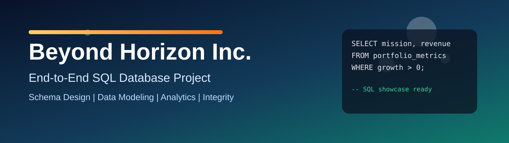

# Beyond Horizon Inc. - SQL Database Project




Production-style relational database design project for a futuristic space tourism company.

## Project Summary
Beyond Horizon Inc. is a simulated space travel company operating in a high-scale, data-intensive environment. This project models the core business workflow end to end: workforce management, travel package sales, customer bookings, insurance, voyages, medical metrics, crew operations, certifications, and payments.

This repository demonstrates practical SQL engineering skills:
- Relational schema design with primary/foreign keys
- Domain modeling across multiple business functions
- Data seeding for realistic simulation scenarios
- Analytical querying for operational and business insights

## Why This Project Stands Out
- Strong domain narrative (space tourism) mapped to normalized relational entities
- Multi-module architecture (HR, customer, voyage operations, finance, safety)
- Recruiter-friendly business questions and analytical SQL examples
- Clear improvement roadmap for production hardening

## Tech Stack
- SQL (DDL + DML + analytical queries)
- ERD modeling tools (draw.io / Lucidchart style workflow)
- SQL Server style query syntax in sample queries (for example, `GETDATE`, `DATEADD`)

## Database Scope
The schema currently includes 18 core tables:
- Employees
- Payroll
- Operations_Managers
- Service_Associate
- Ground_Staff
- Crew
- Traveler
- Review
- Package
- Spacecraft
- Booking
- Insurance_Type
- Insurance
- Medical_Metrics
- Trainings
- Voyage_Info
- Payments
- Certifications

## Data Model Preview
### Conceptual Database Diagram


### Final ERD


### Example Table Snapshot


## Repository Structure
- `schema.sql` - schema creation script (DDL)
- `seed_data.sql` - sample data load script (DML)
- `setup.sql` - setup orchestration entry point
- `sample_queries.sql` - exploratory SQL question bank
- `portfolio_queries.sql` - recruiter/demo focused analytical SQL pack
- `validation_checks.sql` - post-load data integrity and quality checks
- `performance_indexes.sql` - index creation script for common join/filter paths
- `DATA_DICTIONARY.md` - table-by-table schema reference
- `assets/banner.svg` - project banner image used in this README
- `README.md` - project documentation

## Quick Start
1. Create a new database in your SQL environment.
2. Open `setup.sql` and run it in SQL Server SQLCMD mode (SSMS: Query -> SQLCMD Mode).
3. Execute `portfolio_queries.sql` for showcase analytics.
4. Execute `sample_queries.sql` for additional practice prompts.
5. Execute `validation_checks.sql` to verify table loads and quality rules.
6. Execute `performance_indexes.sql` to apply recommended indexes for analysis workloads.

## Completed Professional Upgrades
- Standardized all SQL file names for clean execution flow.
- Added `setup.sql` as a single orchestration starting point.
- Added `DATA_DICTIONARY.md` to document entities, keys, and column intent.
- Added `validation_checks.sql` for data integrity and quality auditing.
- Added `performance_indexes.sql` for practical indexing and query performance.
- Added a local banner section for stronger visual presentation on GitHub.

## Portfolio Query Examples
Below are a few showcase-ready examples aligned to this project theme.

### 1. Travelers Booking Above Average Package Price
```sql
SELECT t.Traveler_id, t.Traveler_Name, p.Description AS Package_Description, p.Price
FROM Traveler t
JOIN Booking b ON b.Traveler_id = t.Traveler_id
JOIN Package p ON p.Package_id = b.Package_id
WHERE p.Price > (SELECT AVG(Price) FROM Package)
ORDER BY p.Price DESC;
```

### 2. Total Revenue by Package
```sql
SELECT p.Package_id, p.Description, SUM(pay.Amount) AS Total_Revenue
FROM Package p
JOIN Booking b ON b.Package_id = p.Package_id
JOIN Payments pay ON pay.Booking_id = b.Booking_id
GROUP BY p.Package_id, p.Description
ORDER BY Total_Revenue DESC;
```

### 3. Insurance Adoption Rate
```sql
SELECT
	COUNT(CASE WHEN Insurance_opted = 'Yes' THEN 1 END) * 100.0 / COUNT(*) AS Insurance_Adoption_Percent
FROM Booking;
```

### 4. Average Rating by Traveler
```sql
SELECT t.Traveler_id, t.Traveler_Name, AVG(CAST(r.Rating AS DECIMAL(10,2))) AS Avg_Rating
FROM Traveler t
JOIN Review r ON r.Traveller_Id = t.Traveler_id
GROUP BY t.Traveler_id, t.Traveler_Name
ORDER BY Avg_Rating DESC;
```

## Business Questions This Model Can Answer
- Which travel packages generate the highest revenue?
- What is the insurance adoption trend across bookings?
- Which service teams and managers support the most travelers?
- Which spacecraft and voyage routes have higher commercial demand?
- How do ratings, payment behavior, and package selection correlate?

## Skills Demonstrated
- Relational design and schema planning
- Key constraints and referential integrity setup
- SQL joins, aggregations, subqueries, grouping, and ranking
- Domain-driven data modeling
- Portfolio storytelling using data

## Current Gaps and Practical Improvements
To make this project production-grade, these are the next recommended upgrades:
- Align all sample queries strictly with current column names and relationships.
- Add constraints/checks for rating ranges, non-negative pricing, and status validation.
- Add execution screenshots or result snapshots for top portfolio queries.
- Add CI-style SQL validation flow to run `validation_checks.sql` automatically.

## Suggested Next Milestones
1. Add stored procedures for common workflows (new booking, payment settlement, insurance assignment).
2. Create SQL views for reporting dashboards (revenue, utilization, customer satisfaction).
3. Introduce automated validation queries for data quality checks.
4. Add transaction handling examples for booking and payment operations.

## About This Portfolio Project
This repository is designed to showcase SQL fundamentals plus database product thinking: not only writing queries, but modeling a realistic business system and communicating it professionally.

